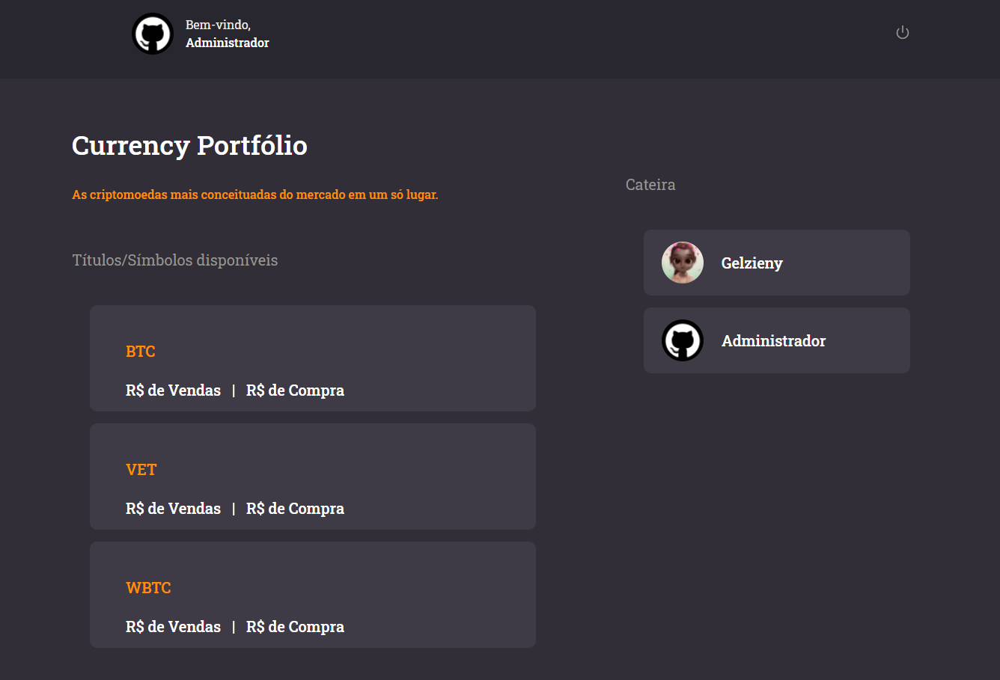

<h1 align="center">
    
</h1>


<p align="center">
  <a href="#page_with_curl-sobre">Sobre</a>&nbsp;&nbsp;&nbsp;|&nbsp;&nbsp;&nbsp;
  <a href="#books-requisitos">Requisitos</a>&nbsp;&nbsp;&nbsp;|&nbsp;&nbsp;&nbsp;
  <a href="#rocket-começando">Começando</a>&nbsp;&nbsp;&nbsp;|&nbsp;&nbsp;&nbsp;
  <a href="#gear-iniciando-back-end">Node.js</a>&nbsp;&nbsp;&nbsp;|&nbsp;&nbsp;&nbsp;
  <a href="#computer-iniciando-front-end">ReactJS</a>&nbsp;&nbsp;&nbsp;|&nbsp;&nbsp;&nbsp;
</p>

<br>

<p align="center" style="display: flex; align-items: flex-start; justify-content: center;">
  
  
</p>

## :page_with_curl: Sobre
Este repositório contém um API REST em Node.js como back-end, uma aplicação em ReactJS como front-end, todos utilizando TypeScript.

Essa é a aplicação Currency Portfólio, que é uma plataforma de criptomoedas que oferece serviço de corretora e de conta digita.


## :books: Requisitos
- Ter [**Git**](https://git-scm.com/) para clonar o projeto.
- Ter [**Node.js**](https://nodejs.org/en/) instalado.
- Ter [**Docker**](https://www.docker.com/) rodando um container PostgreSQL.


## :rocket: Começando
``` bash
  # Clonar o projeto:
  $ git clone https://github.com/Digitalsa/full-js-test.git

  # Entrar no diretório:
  $ cd full-js-test
```


## :gear: Iniciando back-end
```bash
  # Entrar no diretório do back-end:
  $ cd backend

  # Instalar as dependências:
  $ yarn

  # Rodar as migrations:
  $ yarn typeorm migration:run

  # Rodar a aplicação:
  $ yarn dev:server
```

## :computer: Iniciando front-end
```bash
  # Entrar no diretório do front-end:
  $ cd frontend

  # Instalar as dependências:
  $ yarn

  # Rodar a aplicação:
  $ yarn start
```

Feito com ❤️ por Gelzieny R. Martins 👋🏻 [Entre em contato!](https://www.linkedin.com/in/gelzieny-r-martins-180551106/)

